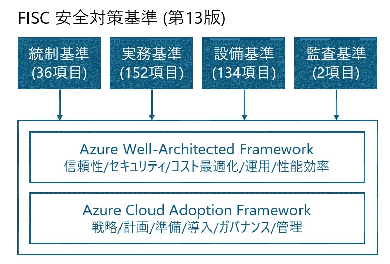

# FISC準拠 金融機関向け Azure Cloud Adoption Framework

> FISC安全対策基準・解説書（第13版）に基づく、日本の金融機関向け Azure Cloud Adoption Framework および Well-Architected Framework ガイダンス

  

> [!CAUTION]
> 本資料は個人で作成したものであり、レビュー中です。FISCおよびAzure CAF/WAFへの準拠における完全性を担保するものではありません。正式な基準内容はFISCの原本を参照してください。

---

## 概要

本フレームワークは、金融情報システムセンター（FISC）が策定した「金融機関等コンピュータシステムの安全対策基準・解説書（第13版、2025年3月）」および「コンティンジェンシープラン策定のための手引書（第5版）」の要件を、Microsoft Azure のクラウドサービス上で実現するための包括的なガイダンスです。

Azure Cloud Adoption Framework（CAF）の導入方法論と Well-Architected Framework（WAF）の5つの柱を基盤とし、FISC基準の324項目（統制基準36項目、実務基準152項目、設備基準134項目、監査基準2項目）をAzureサービスにマッピングしています。

## 対象読者

| 対象 | 活用方法 |
|------|---------|
| 金融機関のIT部門・システムリスク管理部門 | FISC準拠のクラウド設計指針として |
| 経営層・CIO/CISO | クラウド移行の意思決定・リスク評価に |
| SIer・コンサルタント | 金融機関向けAzure提案の参考資料として |
| アーキテクト・エンジニア | システム別ランディングゾーンの設計・実装に |

---

## 📘 ドキュメント

FISC安全対策基準の各領域（ガバナンス・セキュリティ・信頼性・運用・開発・AI等）を Azure のサービスと設計パターンに対応づけたフレームワークドキュメントです。01 から順に読み進めることで、FISC準拠の全体像を把握できます。

### FISC × Azure フレームワーク

| # | ドキュメント | 概要 | 対応FISC基準 |
|---|------------|------|------------|
| 01 | [フレームワーク概要](docs/01-overview.md) | 全体構造・FISC×CAF×WAFの統合 | 全体 |
| 02 | [ITガバナンス・統制](docs/02-governance.md) | 経営層の役割・方針策定・体制整備 | 統1〜統28 |
| 03 | [セキュリティ](docs/03-security.md) | 認証・暗号化・ネットワーク・サイバー対策 | 実1〜実19, 実25〜実30 |
| 04 | [信頼性・事業継続](docs/04-reliability.md) | DR・バックアップ・コンティンジェンシープラン | 実39〜実45, 実71〜実73-1 |
| 05 | [運用管理](docs/05-operations.md) | システム運用・監視・変更管理 | 実34〜実62 |
| 06 | [セキュア開発](docs/06-development.md) | 開発プロセス・テスト・品質管理 | 実75〜実101 |
| 07 | [クラウドガバナンス](docs/07-cloud-governance.md) | クラウド固有リスク・責任分界・外部委託 | 統20〜統24, 統28 |
| 08 | [AI安全対策](docs/08-ai-safety.md) | AI/生成AIの利用方針・リスク管理 | 実150〜実153 |
| 09 | [監査](docs/09-audit.md) | システム監査・サイバーセキュリティ監査 | 監1, 監1-1 |

### FISC基準 × Azure サービスマッピング

| ドキュメント | 概要 |
|------------|------|
| [FISC基準→Azureサービス マッピング](mapping/fisc-to-azure-services.md) | FISC全324基準項目とAzureサービスの対応表 |
| [システム別 FISC実務基準マッピング](mapping/fisc-workload-mapping.md) | ランディングゾーンごとのFISC実務基準適用要件とAzure実装の横断マッピング |
| [Azure Policy × FISCマッピング](mapping/azure-policy-fisc-mapping.md) | Azure Policy ビルトインポリシーとFISC基準の対応表・ガードレール設計 |

### Azure CAF/WAF との差分

| ドキュメント | 概要 |
|------------|------|
| [Azure CAF/WAF 標準との差分](docs/diff-from-azure-caf.md) | 標準 Azure CAF/WAF に対して FISC 準拠のために追加・変更した要素の説明 |

---

## 🏗️ ランディングゾーン

金融機関の主要システムごとに、Azure 上の具体的なアーキテクチャ設計・サービス構成・FISC基準対応を記載したリファレンスアーキテクチャ集です。各ドキュメントは独立して参照でき、Hub-Spoke ネットワーク上の Spoke として設計されています。

> [FSI向けAzureランディングゾーン リファレンスアーキテクチャ](landing-zone/reference-architecture.md) — 全体アーキテクチャ・Hub-Spoke ネットワーク・FISC準拠ポリシー

### 基幹系システム

| システム | ドキュメント |
|---------|------------|
| 勘定系（コアバンキング） | [アーキテクチャ: 勘定系（コアバンキング）](landing-zone/core-banking.md) |
| 為替・決済系 | [アーキテクチャ: 為替・決済系](landing-zone/payment-settlement.md) |
| 融資系 | [アーキテクチャ: 融資系](landing-zone/lending.md) |
| 市場系・トレーディング | [アーキテクチャ: 市場系・トレーディング](landing-zone/market-trading.md) |
| 対外接続系（全銀/SWIFT等） | [アーキテクチャ: 対外接続系（全銀/SWIFT等）](landing-zone/external-connectivity.md) |

### チャネル系システム

| システム | ドキュメント |
|---------|------------|
| インターネットバンキング | [アーキテクチャ: インターネットバンキング](landing-zone/internet-banking.md) |
| モバイルバンキング | [アーキテクチャ: モバイルバンキング](landing-zone/mobile-banking.md) |
| ATM系 | [アーキテクチャ: ATM系](landing-zone/atm.md) |
| APIバンキング（オープンAPI） | [アーキテクチャ: APIバンキング（オープンAPI）](landing-zone/api-banking.md) |

### 情報・管理系システム

| システム | ドキュメント |
|---------|------------|
| 情報系・DWH/BI | [アーキテクチャ: 情報系・DWH/BI](landing-zone/dwh-bi.md) |
| リスク管理系 | [アーキテクチャ: リスク管理系](landing-zone/risk-management.md) |
| AML/KYC（マネロン対策） | [アーキテクチャ: AML/KYC（マネロン対策）](landing-zone/aml-kyc.md) |

### セキュリティ・レジリエンス基盤

| システム | ドキュメント |
|---------|------------|
| サイバーレジリエンス | [アーキテクチャ: サイバーレジリエンス](landing-zone/cyber-resilience.md) |

### メインフレーム連携・移行

| システム | ドキュメント |
|---------|------------|
| メインフレーム連携・移行 | [アーキテクチャ: メインフレーム連携・移行](landing-zone/mainframe-integration.md) |

### ハイブリッド構成

| システム | ドキュメント |
|---------|------------|
| ハイブリッド構成（Azure Local/Arc） | [アーキテクチャ: ハイブリッド構成](landing-zone/hybrid.md) |

### イノベーション・開発基盤

| システム | ドキュメント |
|---------|------------|
| 生成AI/エージェント基盤 | [アーキテクチャ: 生成AI/エージェント基盤](landing-zone/ai-platform.md) |
| 開発基盤（Engineering Platform） | [アーキテクチャ: 開発基盤（Engineering Platform）](landing-zone/engineering-platform.md) |

---

## 🛡️ ガバナンスベース（IaC）

FISC準拠の Azure ガバナンスベースラインをデプロイするための Bicep テンプレートです。Management Group 階層、Azure Policy（FISC ガードレール）、Microsoft Defender for Cloud、中央ログ基盤を自動構成します。

| コンポーネント | 説明 |
|--------------|------|
| [ガバナンスベース デプロイガイド](governance/README.md) | 前提条件・デプロイ手順・検証手順 |
| [Management Group 階層](governance/modules/management-groups.bicep) | FISC Tier 別の管理グループ構成 |
| [Azure Policy 割当](governance/modules/policy-assignments.bicep) | MCSB + FISC 準拠ポリシー割当 |
| [Defender for Cloud](governance/modules/defender.bicep) | 全プラン有効化・セキュリティ連絡先 |
| [中央ログ基盤](governance/modules/log-analytics.bicep) | 730日保持・Sentinel・Private Link |
| [監査ストレージ](governance/modules/audit-storage.bicep) | WORM ポリシー・イミュータブル保存 |

---

## FISC基準と Azure WAF の対応構造

  

---

## FISC第13版 主な改訂ポイント（2025年3月）

| # | 改訂項目 | 概要 |
|---|---------|------|
| 1 | **経済安全保障推進法への対応** | 特定社会基盤事業者としての義務 |
| 2 | **オペレーショナル・レジリエンス** | 金融庁ガイドラインへの対応 |
| 3 | **サイバーセキュリティガイドライン** | 金融庁2024年10月公表ガイドライン |
| 4 | **AI安全対策** | 生成AI利用のリスク管理基準を新設（実150〜153） |
| 5 | **サプライチェーンセキュリティ** | 統28を新設 |

---

## Azure 金融機関 公開事例（Microsoft 発表）

Microsoftが公式に発表している金融機関のAzure活用事例です。

### 🇯🇵 国内事例

| 企業名 | 概要 | リンク |
|--------|------|--------|
| 山梨中央銀行 | Azure OpenAI Service を全行導入し、生成AIによる業務効率化・インサイト営業を推進 | [Customer Story](https://www.microsoft.com/ja-jp/customers/story/24415-yamanashi-chuo-bank-azure-openai) |
| BIPROGY（BankVision） | 国内初の Azure を稼働基盤とする銀行勘定系システムを構築（12行で採用） | [Customer Story](https://www.microsoft.com/ja-jp/customers/story/22503-biprogy-azure) |
| 三井住友フィナンシャルグループ | 日本の大手銀行として初めてMicrosoftと複数年の戦略的クラウド提携を締結 | [Microsoft News](https://news.microsoft.com/apac/2022/10/28/how-smbc-group-became-a-leader-in-transformation-and-digital-perseverance/) |
| 第一生命ホールディングス | Microsoftとの戦略的グローバルパートナーシップを締結、Azure を優先クラウド基盤に | [Microsoft News](https://news.microsoft.com/ja-jp/2024/08/23/240823-dai-ichi-life-holdings-x-microsoft-global-strategic-partnership-to-accelerate-digital-innovation/) |

### 🌍 海外事例

| 企業名 | 国・地域 | 概要 | リンク |
|--------|---------|------|--------|
| Discovery Bank | 南アフリカ | Azure + Databricks で AI 駆動のパーソナライズド金融サービス、500% ROI | [Customer Story](https://www.microsoft.com/en/customers/story/23562-discovery-bank-azure) |
| Ally Financial | 米国 | Azure OpenAI Service で顧客サービスの手動タスクを自動化 | [Customer Story](https://www.microsoft.com/en/customers/story/1715820133841482699-ally-azure-banking-en-united-states) |
| Banco Bradesco | ブラジル | Microsoft Foundry 上にマルチエージェント生成AI基盤を構築、解決率83% | [Customer Story](https://www.microsoft.com/en/customers/story/25660-banco-bradesco-sa-azure-ai-foundry/) |
| Capitec Bank | 南アフリカ | M365 Copilot + Azure OpenAI で従業員の生産性向上（週1時間以上の節約） | [Customer Story](https://www.microsoft.com/en/customers/story/19093-capitec-bank-azure-open-ai-service) |

> 最新の事例は [Microsoft Customer Stories](https://www.microsoft.com/en-us/customers/) および [Azure Customer Stories](https://azure.microsoft.com/en-us/resources/customer-stories/) で確認できます。

---

## 関連リソース

| リソース | リンク |
|---------|-------|
| Azure Cloud Adoption Framework | [learn.microsoft.com](https://learn.microsoft.com/azure/cloud-adoption-framework/) |
| Azure Well-Architected Framework | [learn.microsoft.com](https://learn.microsoft.com/azure/well-architected/) |
| Microsoft for Financial Services | [learn.microsoft.com](https://learn.microsoft.com/industry/financial-services/) |
| Azure コンプライアンス認証 | [learn.microsoft.com](https://learn.microsoft.com/azure/compliance/) |
| FISC 金融情報システムセンター | [fisc.or.jp](https://www.fisc.or.jp/) |

---

*本フレームワークは FISC安全対策基準・解説書 第13版（2025年3月）および コンティンジェンシープラン策定のための手引書 第5版（2025年3月）に基づいています。*
